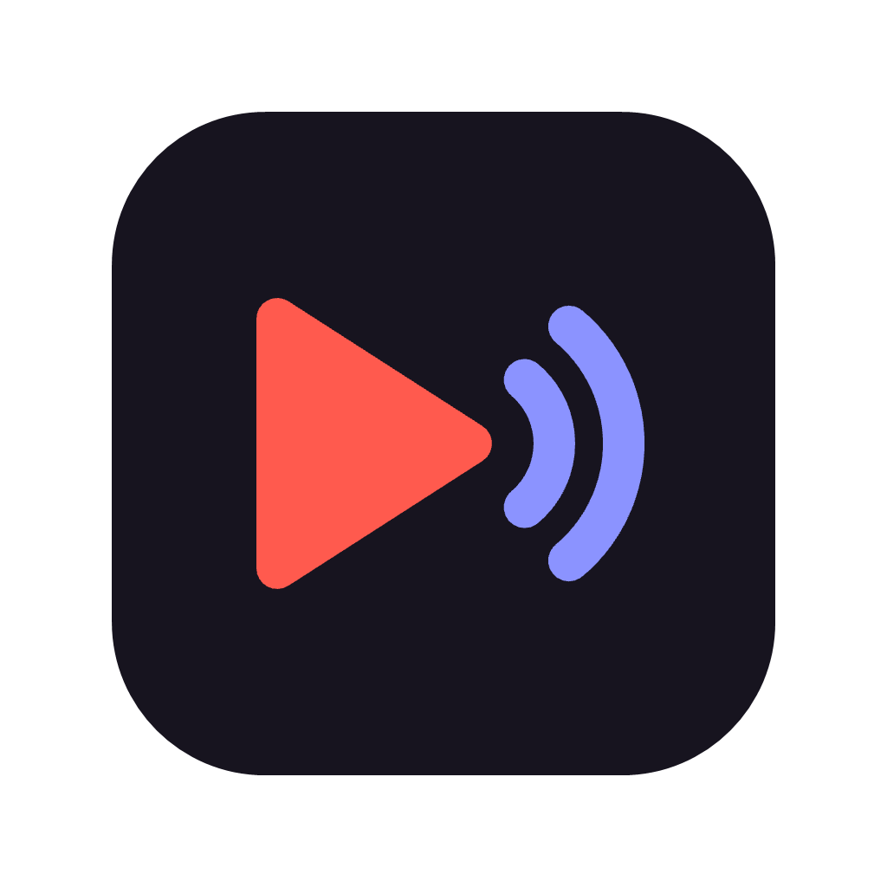

<p align="center"></p>

# Discord YouTube DJ

Play music in your Discord voice channel from:

- 🌐 **your browser** — whatever you open on YouTube or YouTube Music plays in Discord automatically
- 💬 **Discord** — `/play <song or link>` and `/stop`
- 🖥️ **a local dashboard** — search, pick a channel, play
- 🤖 **an AI assistant** — "play some lo-fi in the Lobby", via the companion [discord-music-mcp](https://github.com/cengizhanpece/discord-music-mcp) repo

The bot runs **on your own computer**. Nothing is hosted anywhere, and YouTube works reliably because requests come from your home connection.

---

## How the pieces fit together

```
                         your computer
 ┌────────────────────────────────────────────────────────────────┐
 │                                                                │
 │  Browser extension ─┐                                          │
 │  (this repo)        │                                          │
 │                     │   HTTP, 127.0.0.1:1231                   │        ┌──────────┐
 │  Dashboard ─────────┼──────────────────────►  Bot  ─────────────┼──────► │ Discord  │
 │  (served by the bot)│                       (this repo)         │ voice  │          │
 │                     │                           ▲               │        └────┬─────┘
 │  MCP server ────────┘                           │               │             │
 │  (discord-music-mcp repo,                       └── yt-dlp ─────┼──► YouTube  │
 │   started by Claude)                                            │             │
 └────────────────────────────────────────────────────────────────┘     /play, /stop
                                                                    (slash commands)
```

| Part | Repo | Required? | What it does |
|---|---|---|---|
| **Bot** + dashboard | this repo, `bot/` | ✅ yes | Joins your voice channel and streams audio. Everything else talks to it. |
| **Browser extension** | this repo, `extension/` | optional | Sends the video you open on YouTube to the bot. |
| **MCP server** | [discord-music-mcp](https://github.com/cengizhanpece/discord-music-mcp) | optional | Lets Claude (or another MCP client) control the bot. |

The extension and the MCP server **never talk to Discord directly** and never see your bot token. They only call the bot's local API on `http://localhost:1231`, so they must run on the same computer as the bot.

---

## What you need

| Item | Needed? | Secret? | Where you get it | Where it goes |
|---|---|---|---|---|
| Discord **bot token** | ✅ | 🔒 **yes** — like a password | Developer Portal → your app → **Bot** → **Reset Token** | Pasted once into the dashboard (stored in `config.json`, see below) |
| "Manage Server" permission on the target Discord server | ✅ | — | You own the server, or ask an admin | Needed to accept the bot invite |
| Voice channel | ✅ | — | Picked from a list in the dashboard / extension | Saved automatically |
| Text channel IDs for "Now playing" messages | optional | no | Discord → **Settings → Advanced → Developer Mode** on, then right-click a channel → **Copy Channel ID** | `notificationChannels` in `config.json` |

**Not needed** (in case you're used to other bots): no Application ID, no Client Secret, no Public Key, no OAuth2 redirect, no **Privileged Gateway Intents**, no server/channel IDs to type in, no extension ID, no YouTube API key, no YouTube cookies.

---

## Setup

### 1. Install the bot

**Windows (recommended):** download **`DiscordYouTubeDJ-Setup-x.y.z.exe`** from the [latest release](https://github.com/cengizhanpece/discord-youtube-dj/releases/latest) and run it. No admin rights or Node.js needed.

> Windows may show *"Windows protected your PC"* because the installer isn't code-signed. Click **More info → Run anyway**.

When it finishes, the dashboard opens at <http://localhost:1231>.

**macOS / Linux / from source:** needs [Node.js](https://nodejs.org) 20+ and git.

```bash
git clone https://github.com/cengizhanpece/discord-youtube-dj
cd discord-youtube-dj/bot
npm install
npm start
```

`npm start` opens the dashboard. `yt-dlp` is downloaded automatically on first start and updated on every start.

### 2. Create your Discord bot and get the token

The dashboard shows these steps too.

1. Go to the [Discord Developer Portal](https://discord.com/developers/applications) and sign in.
2. **New Application** → give it a name (this becomes the bot's name, e.g. "DJ") → **Create**.
3. *(Optional)* **General Information** → upload an avatar (you can use [`assets/icon.png`](assets/icon.png)).
4. Open the **Bot** tab:
   - Click **Reset Token** → **Yes, do it!** → **Copy**. This is your **bot token**.
   - *(Recommended)* turn **Public Bot** **off**, so only you can add the bot to servers.
   - Leave all **Privileged Gateway Intents** off; they aren't used.
5. Paste the token into the dashboard → **Save**. The dashboard checks the token with Discord before saving it.

### 3. Invite the bot to your server

Click **Invite to server** in the dashboard. It opens Discord with the right permissions already filled in (View Channels, Send Messages, Connect, Speak, and slash commands). Pick your server → **Authorize**.

Use **Invite to another server** later to add more servers.

#### Private (hidden) voice channels

The default invite only asks for the minimum permissions, so the bot can't join **private channels** that your server hides from regular members. These show up with a 🔒 in the dashboard and extension and can't be selected. You have two options:

- **Recommended:** give the bot access to just the channels you need. In Discord, right-click the channel → **Edit Channel** → **Permissions** → **Add members or roles** → pick the bot → allow **View Channel**, **Connect** and **Speak**. The list in the dashboard updates by itself.
- **Invite as Administrator:** the dashboard has this under *Need private channels?*. The bot then sees every channel. ⚠️ Anyone who gets your bot token could then do anything on that server, such as delete channels or ban members. Only do this on servers where you accept that risk.

### 4. Pick a voice channel

Pick a voice channel in the dashboard and try **Play**. That's the core setup done.

### 5. Browser extension (optional)

Works in Chrome, Edge, Brave, Opera and other Chromium browsers.

1. Download **`DiscordYouTubeDJ-Extension-x.y.z.zip`** from the [latest release](https://github.com/cengizhanpece/discord-youtube-dj/releases/latest). Unzip it somewhere permanent, e.g. `Documents\DiscordYouTubeDJ-Extension`. If you delete the folder, the extension stops working.
2. Open `chrome://extensions` (or `edge://extensions`, `brave://extensions`…) and turn on **Developer mode**.
3. **Load unpacked** → pick the unzipped folder (the one containing `manifest.json`).
4. Pin the extension, click it, switch it **on**, choose a voice channel, and open a YouTube video.

You don't need to enter an extension ID or any other ID. The extension finds the bot at `http://localhost:1231`. If you changed the bot's port, set it in the extension under **Settings → Bot address**.

**Updating:** unzip the new version over the same folder, then click ↻ on the extension card in `chrome://extensions`.

### 6. Slash commands (no setup)

In any server the bot is in, type `/play <song or link>` while you are in a voice channel, or `/stop`. Slash commands can take a few minutes to appear the first time.

### 7. AI assistant / MCP (optional)

Follow the setup in [discord-music-mcp](https://github.com/cengizhanpece/discord-music-mcp#setup). It needs this bot running and set up first, plus Node.js 20+ and git. It doesn't need your token.

---

## Settings, secrets and files

Everything lives in one per-user folder (shown under **Advanced** in the dashboard):

| OS | Folder |
|---|---|
| Windows | `%APPDATA%\discord-youtube-dj` |
| macOS | `~/Library/Application Support/discord-youtube-dj` |
| Linux | `~/.config/discord-youtube-dj` |

It contains:

- `config.json`: your settings. **It contains your bot token. Never share it or commit it to git.**
  ```jsonc
  {
    "token": "…",                  // set by the dashboard
    "port": 1231,                  // local API/dashboard port
    "guildId": "…",                // last picked voice channel, set automatically
    "channelId": "…",
    "notificationChannels": []     // optional: text channel IDs that get "Now playing" messages
  }
  ```
  Restart the bot after editing the file by hand.
- `bot.log`: log file. Check this first when something goes wrong.
- `bin/yt-dlp(.exe)`: downloaded automatically.

**Environment variables** override `config.json`. They're handy for servers and containers:

| Variable | Default | Notes |
|---|---|---|
| `DISCORD_TOKEN` | — | If set, the dashboard can't change the token. |
| `PORT` | `1231` | If you change it, update the extension's **Bot address** and the MCP server's `MUSIC_BOT_URL`. |
| `DATA_DIR` | see table above | Where `config.json`, the log and yt-dlp live. |

**If your token leaks:** Developer Portal → **Bot** → **Reset Token** (the old one stops working immediately). Then open the dashboard → **Advanced** → **Change bot token** and paste the new one.

---

## Local API

The bot listens on `127.0.0.1` only. Browser requests are accepted only from the dashboard itself and from browser extensions. Everything that changes state is `POST` with a JSON body. The extension, the dashboard and the MCP server all use this API.

| Method | Path | Body / query |
|---|---|---|
| GET | `/api/status` | |
| GET | `/api/channels` | |
| POST | `/api/channel` | `{ guildId, channelId }` |
| GET | `/api/search` | `?q=…&limit=5` |
| POST | `/api/play` | `{ song: "<url or search text>", guildId?, channelId? }` |
| POST | `/api/stop` | `{}` |

## Troubleshooting

| Symptom | Fix |
|---|---|
| Extension says **"Bot is not running"** | Start **Discord YouTube DJ** from the Start menu. If you changed the port, update **Settings → Bot address** in the extension. |
| Dashboard says the token was rejected | The token was reset or copied incompletely. Copy a fresh one (**Reset Token**) and paste it again. |
| Voice channel list is empty | The bot isn't in any server yet. Use **Invite to server**. |
| Channel shows 🔒 / *"The bot can't play in …"* | It's a private channel. See [Private voice channels](#private-hidden-voice-channels). |
| Bot joins but there's no sound | Check `bot.log`. Make sure the bot has **Connect** and **Speak** permission in that channel. |
| `/play` doesn't show up | Wait a few minutes after the first start, or re-invite the bot with the dashboard's invite link (it includes the commands scope). |
| "Sign in to confirm you're not a bot" in the log | YouTube is rate-limiting your IP. Wait a while. |

## Uninstall

Windows: **Settings → Apps → Discord YouTube DJ → Uninstall**. Your settings folder (with the token) is kept. Delete `%APPDATA%\discord-youtube-dj` to remove it too. To revoke the bot completely, delete the application in the Developer Portal.

---

## Project layout

```
bot/         Node.js bot + local dashboard (bot/public)
extension/   Chromium extension (Manifest V3)
installer/   Windows installer: build.mjs stages files, setup.iss is the Inno Setup script
assets/      Source icon
```

**Releasing:** push a tag `vX.Y.Z`. GitHub Actions builds the installer and the extension zip and attaches them to a new release.

## License

MIT
